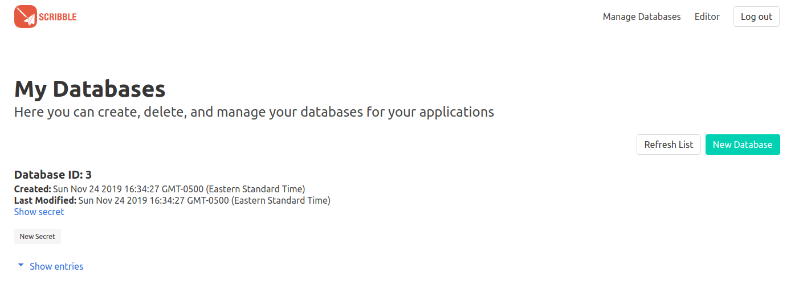

# User Databases
ScribbleBase is a simple, single table, noSQL database that is easily integrated into anyone's Python Projects. It allows users to create their own databases to store data for their applications. These databases can hold any types of data. In this guide we will walk though how to create a simple application that makes use of user databases.

## Creating the database
The first thing we need to do before storing our data is to create a database. Simply login and navigate to `Manage Database` from the navigation bar on the homepage.
Once here we can create the database by clicking on `New Database`. You will be greeting by an input window. In this window, name all of the database columns you wish to use and create the database by clicking `Create Database`. For this example, we will be creating  database with the columns 'firstname', 'lastname', and 'salary'. A listing of your newly created database will appear on the screen as shown below. Be sure to write down your database ID and secret. ***Do not share you database secret with anyone.***


## Inserting a row into the database
The next step is to insert our data into our newly created database. Head over to editor and create a new file call `MyProject.py`. We are going to use this program to write data to a new row in the database. `MyProject.py` should contain the following code. Be sure to replace the ID and secret placeholders with your ID and secret.
```python
# Import addRow function from ScribbleBase library
from ScribbleBase import addRow

# Add row to database
database_id = <DATABASE_ID_HERE> # Replace with your database id
secret = '<YOUR_SECRET_HERE>' # Replace with your secret
row = { firstname: 'John', lastname: 'Smith', salary: '$60000' }
try:
  addRow(database_id, secret, row)
  print('Row successfully inserted into the database')
except:
  print('There was an error inserting row into the database')
  exit(1)
```
After executing the script, if we now go back to `Manage Databases`, we will notice that our database has been populated with the new row.


## Finding a row in the database
Finding a row in the database can also be done using a function called `findRow` in the ScribbleBase library. Lets append that to our code to find the row that we just inserted to find anyone with the first name 'John'.
```python
# Import addRow function from ScribbleBase library
from ScribbleBase import addRow

# Add row to database
database_id = <DATABASE_ID_HERE> # Replace with your database id
secret = '<YOUR_SECRET_HERE>' # Replace with your secret
row = { firstname: 'John', lastname: 'Smith', salary: '$60000' }
try:
  addRow(database_id, secret, row)
  print('Row successfully inserted into the database')
except:
  print('There was an error inserting row into the database')
  exit(1)

# Find row in the database
requested_columns = '*'
comparison_column = 'firstname'
comparison = 'IS_EQUAL_TO'
operand = 'John'
try:
  response = findRow(database_id, secret, request_columns, row, comparison_column comparison, operand)
  response = str(response)
  print('Found row(s)')
  print(response)
except:
  print('There was an error finding row in the database')
  exit(1)
```

## Removing a row from the database
If we no longer want a row in the database, using the function `delRow` from the ScribbleBase library, we can remove that unwanted row. Lets write it.
```python
# Import addRow function from ScribbleBase library
from ScribbleBase import addRow

# Add row to database
database_id = <DATABASE_ID_HERE> # Replace with your database id
secret = '<YOUR_SECRET_HERE>' # Replace with your secret
row = { firstname: 'John', lastname: 'Smith', salary: '$60000' }
try:
  addRow(database_id, secret, row)
  print('Row successfully inserted into the database')
except:
  print('There was an error inserting row into the database')
  exit(1)

# Find row in the database
requested_columns = '*'
comparison_column = 'firstname'
comparison = 'IS_EQUAL_TO'
operand = 'John'
try:
  response = findRow(database_id, secret, request_columns, comparison_column, comparison, operand)
  response = str(response)
  print('Found row(s)')
  print(response)
except:
  print('There was an error finding row in the database')
  exit(1)

# Remove row from the database
try:
  delRow(database_id, secret, comparison_column, comparison, operand)
  print('Successfully removed row(s)')
except:
  print('There was an error removing row(s)')
  exit(1)
```

## Deleting a database
If you have an unwanted database, to remove it, simply go to `Manage Databases` and click on the `Show Entries` dropdown. Clicking on `Delete Database` will prompt you to make sure that you want to delete the database. Clicking `Delete Database` again will permanently delete the database and all of its contents. ***Warning: This action cannot be undone.***
